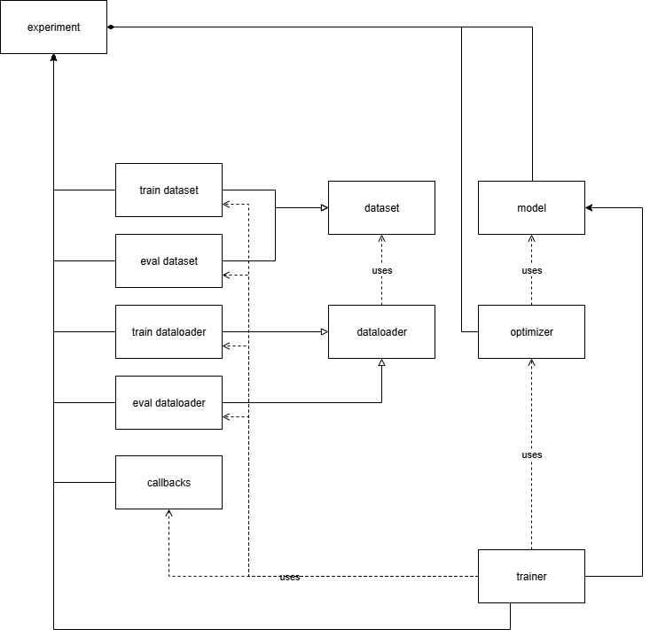

# BlockTrain

Component building blocks for ML training

# Quickstart

To interact with the training pipeline codebase and supporting artifacts, please use the Developer installation instructions to 

### Developer Installation

- clone the project from [`https://github.com/loppjp/blocktrain`](https://github.com/loppjp/blocktrain)
- use a recent version of python (e.g. 3.12) to get started
    - `python3.12 -m venv env`
- upgrade to the latest version of the python package manager
    - `pip install -U pip`
- This project uses poetry for dependency management. Install poetry:
    - `pip install poetry`
- Install blocktrain
    - `poetry install`
- Alternatively, to enable jupyter notebooks and unit tests install as
    - `poetry install --with dev,notebooks`

### Training Usage

from the commandline after installation run: <br>

    $ blocktrain train

### Unit Test Usage

from the commandline after installation run: <br>

    $ pytest

### Recommended Development Environment

This project was developed with vscode running within a WSL2 Red Hat Universal Base Image development environment. 

To run jupyter notebooks a recommendation is to install the Microsoft Jupyter vscode plugin (ms-toolsai.jupyter)

### Notebook Usage

Jupyter notebooks are used in the development of the training pipeline and for data analysis. After following the installation instructions, the notebooks are accessable after:

- (Recommended) installation of the Jupyter plugin
- (Recommended) specification of the ipython kernel to match the user's python environment


### Recommended Pre-checks for Training

It is recommended that training be run within a linux environment

To ensure the target training device is ready to support some steps can be taken:

#### 1. NVIDIA SMI

to test from the command line run: <br>

    $ nvidia smi

Expect the following results within a text block with NVIDIA driver information:
```
(env) [jacob@rhel8 blocktrain]$ nvidia-smi
Fri Aug 15 15:46:53 2025       
+-----------------------------------------------------------------------------------------+
| NVIDIA-SMI 570.133.07             Driver Version: 572.83         CUDA Version: 12.8     |
|-----------------------------------------+------------------------+----------------------+
| GPU  Name                 Persistence-M | Bus-Id          Disp.A | Volatile Uncorr. ECC |
| Fan  Temp   Perf          Pwr:Usage/Cap |           Memory-Usage | GPU-Util  Compute M. |
|                                         |                        |               MIG M. |
|=========================================+========================+======================|
|   0  NVIDIA GeForce RTX 4090        On  |   00000000:01:00.0  On |                  Off |
|  0%   37C    P8             23W /  450W |    1548MiB /  24564MiB |      0%      Default |
|                                         |                        |                  N/A |
+-----------------------------------------+------------------------+----------------------+
                                                                                         
+-----------------------------------------------------------------------------------------+
| Processes:                                                                              |
|  GPU   GI   CI              PID   Type   Process name                        GPU Memory |
|        ID   ID                                                               Usage      |
|=========================================================================================|
|  No running processes found                                                             |
+-----------------------------------------------------------------------------------------+
```

#### 2. Torch CUDA availability

to test run: <br>

    source env/bin/activate
    python -c "import torch;print(torch.cuda.is_available())"`

The expected stdout return should be:

    True

### Evaluation Usage

TBD

---

# Request for Discussion

## 1. Initial Directions and statement breakdown

Given the stakeholder's request for a result within a short timeframe, some initial assumptions are considered. These initial assumptions will be refined when data analysis is completed. Initially, given a quick read of the stakeholder's initial input, we can infer that we may be able to:

- Apply used supervised learning techniques to solve the problem
- Other considerations are in the following talbe

|         Data               |                             Response                      |
| -------------------------- | --------------------------------------------------------- |
| "Design an ML pipeline..." | Leverage a machine learning framework to train an ML model |
| "set of videos as target test cases" | Visual detection modality suggests we should consider computer vision models |


The stakeholder has provided the desire for a 
 > prototype model for target recognition of a drone target

This strongly implies the desire for a machine learning computer vision model capabile of target recognition that is conditioned on the provided training dataset and able to acheive some level of performance (unspecified) on the test dataset.

Some other considerations:
- Deep learning, specifically deep computer vision may be applicable for this use case due to computer vision models' ability to recognize objects when conditioned on data


## 2. Description of Training Pipeline

Machine learning can be thought of as multiple, sometimes disparate data intensive, and compute intensive processes. Training pipelines take, as inputs, a dataset, and a model architecture, as well as hyperparameters and transform these into parameters that can be used for inference.

### 2.1 Desired Training Pipeline Features

Initially, the training pipeline should:
1) Expose a simple API for typical interactions:
     - with functions like `train`, `eval`, `predict` where:
        - `train`: conditions an ML on a dataset and results in the generation of a set of weights to be deployed
        - `eval`: evaluates a model and trained weights against a dataset to determine metrics
        - `predict`: performs inference on a batch of examples and produces results in some format.
2) Support additional interactions:
    - `save_weights`: save the model weights for training, ideally using torch APIs
    - `load_weights`: load the model weights for training, ideally using torch APIs
    - `save`: save the entire experiment, including any metrics, hyperparameters, experiment specification
    - `load`: load the entire experiment, including any metrics, hyperparameters, experiment specification
3) Be Configurable:
    - such that datasets, training, parameters, and ML models can be relatively easily replaced.
4) Experiments as a first-class-citizen
    - The design should facilitate a usage pattern where a typical interaction is to specify one or more experiments to conduct with a given purpose.

### 2.2 "BlockTrain" Training Pipeline Component Design

2.2.1 Experiment Specification

The Experiment Specification is a design construct of the pipeline that allows component level data driven experimentation. That is, a user can adjust the parameters of the training experiment to quickly acheive different results in a config-driven way. Machine learning training pipelines have canonical components that are shared across many implementations. These include datasets, models, callbacks, etc. The Experiment Specification allows these items to be changed, or for the parameters of each to be adjusted to facilitate the current experiment.

2.2.3 Components

The blocktrain training pipeline is focused on pairing an experiment specification with a trainer which uses components to condition a model on data:



2.2.4 Torch Datasets and Dataloaders

Pytorch datasets are a common and very practical way to interact with streaming or map style datasets. Implementing datasets is typically trival, especially for small datasets that can fit on the filesystem for a single workstation. Torch Dataloaders support various batch loading paradigms and can simplify and streamling the training process. For this training pipeline we will leverage torch datasets. Future work can bring Datasets and Dataloading constructs from other training frameworks (e.g. huggingface or pytorch lighting)

2.2.5 Component Interfaces

The blocktrain training pipeline uses pytorch interfaces for all components:


2.2.6 Callbacks

A training loop has distinct points in time that can be considered events. These events can be at the start of training, the start of an epoch, the start of a training step, or even upon a failure of some kind. The callbacks that will be available are described in the [callbacks api](./src/blocktrain/callbacks.py).

## 3. Analysis and Prep of Training Datasets

3.1 Initial Data Exploration

3.1.1 non MATLAB dataset training analysis
    
The stakeholder has indicated that there is a preference toward the "2nd/non-Matlab" dataset. As such, initial exploration will focus on this dataset. This dataset contains 13502 png files. The data is distributed into 18 folders. Each folder there is a single json file, presumably the labels. Each folder contains a varied number of images with a minimum of 487 to a maximum of 1630.

Additional investigation can be found in this interactive notebook: [dataset_exploration](./notebooks/ir_dataset_folder_analysis.ipynb)

3.1.2 Bounding box analysis

TBD

3.1.2.1 Existance Distribution

TBD

3.1.2.3 Locality distribution

How are the the bounding box center positions distributed amongst the training data? This analysis is especially useful for CV models that lack spatial invariance, potentially including transformer vision models. Fully convolutional models should be less affected. There may also be knock on effects in data augmentation.

3.1.3 Image size

Util otherwise determined, images in the dataset have been determined to be 512x512 with color.

3.1.4 Dataset Size

The .png file dataset is small enough to fit into RAM (~1.3 GB) on the this workstation (has 64 GB RAM). Although we cannot assume this will be the case going forward, it is a simplifying assumption that will help move to a training pipeline in the near term.

## 4. Analysis of prototype sensor model

Specifications of the deployed sensor will be used 

## 5. ML model discussion

Given the initial analysis of the training dataset provided, and stakeholder provided problem constraints, initial experiments will focus on object detection models. Some object detection models that will be initially considered for integration are those that are [available with torchvision here](https://docs.pytorch.org/vision/stable/models.html#object-detection). 

## 6. Priorities

### 6.1 High

- Design artifacts for a CV ML training pipeline.
    - At this time, CV and ML are inferred based on context
- Design artifacts supporting training pipeline development using the Request for Discussion (RFD) Format.
- Publication of source code, RFD on public facing Github.
- Model inference using the test set videos.
- Generation of model weights using one or both training datasets.
- Considerations for the expected sensor and updates to documents and code to support considerations.

### 6.2 Medium

- Documentation of code
- Training Metrics
- Exploratory data analysis notebooks

## 7. Descision Log

### 7.1 Focus on Training Pipeline and prioritization

Per stakeholder input to "Design an ML pipeline", emphasis for this project will be to design a ML training pipeline using a given dataset and target test cases. 

### 7.2 Poetry for dependency management

Poetry is a relatively popular, although somewhat slow, package management system for python. It trades speed for reliability. 

Due to the potential for this project to be evaluated by stakeholders, it is critical that the dependencies be loaded in a reliable way. Since this project will involve experiementation under short timeframes, dependencies may change throughout the design and build process. These changes may lead to instability and time wasted due to ensuring packages are installed in the correct order.

To the developer's knowledge, the suitable package management trade space include pip, poetry, conda, and uv. 

The instability of builds due to ordering leads us to look at options other than vanilla pip except for the initial environment bootstrap. The developer is not as familiar with conda and uv and as such, given the timeframe, would perfer to not use these.

 Without time to evaluate conda and uv, poetry has been chosen for this project to allow dependencies to be added and removed easily during the development process and ideally result in more reproducable builds.

### 7.3 Use of pytorch

There are multiple machine learning frameworks, and multiple deep learning frameworks. Given the need for speed-to-implementation we are choosing to use pytorch due to familiarity and rich ecosystem. Alternatives momentarily considered are tensorflow, jax, scikit learn, open cv.

### 7.4 Data Analysis Training Split
 
 First, shuffle split the training dataset as soon as there is a reasonable mechanism to load data from the source (disk) without doing distribution analysis.

 Begin to do data analysis on a static, stable, shuffled subset of images and data (e.g. 60%/20%/20% split). Leverage this as the training dataset.

 We desire static splitting to ensure that training data does not unintentionally leak into the evaluation and test set. Static is a reference for saving the indicies that will be associated with a given train/eval/test dataset. 

 We desire a stable dataset split that is reproducable across runs, and user (human attempting to train model) interactions. This can be acheived by specifying a seed before shuffling the dataset

 We desire a shuffled dataset to preserve the fundamental idd assumption. That is, the model should train on data that is individually identically distributributed.

 To acheive this, we will save a file to disk called the index list. There can be multiple index lists. They represent the ordered set of training data indicies from the full dataset to use for, training, eval, and test, all separately. 

 The plan will be to save an index list file to disk specifying the particular indicies (of the full dataset) to be used for train/eval/test. This ordering will be used in subsequent training runs will remain stable by virtue of saving the indicies used for training. This is a useful coordination artifact so that other team members can evaluate eachothers' models without risk of leaking training dataset examples. 

 The [`train_eval_test_split.ipynb notebook`](./notebooks/train_eval_test_split.ipynb) will facilitate generation of index list files. The initial index files have been saved as:
 - [`train_indicices.json`](./data/train_indicies.json)
 - [`eval_indicices.json`](./data/eval_indicies.json)
 - [`test_indicices.json`](./data/test_indicies.json)


 In the notebook `notebooks/ir_dataset_folder_analysis.ipynb` we discovered that the images in each folder were unevenly distributed. Ideally this would not be the case, especially if each image folder brings different conditions (environment, lighting, background etc.). For now, this dataset imblanaced will be triaged and risk mitigated by the fact that we can go back and re-generate a index list

### 7.5 Use of Torch Datasets

This implementation will leverage the Dataset APIs from pytorch. Torch datasets are widely used, there is a rich API for combining and sampling different dataset. Given this compositional nature, and due to less familiarity with huggingface datasets and other providers, the choice is to pursue torch datasets for now.

Two initial types of Dataset classes will be created, ones that load from the filesystem with load perations occuring at each invocation of `__getitem__` and the other pre-loading the dataset into RAM at class initialization time.

This is done to allow flexibility in workflows depending on RAM or disk utilization. The expectation will be to use the RAM based datasets more often.

The Experiment class will have a dataloader. This will be highly coupled to the pytorch API for now. 

## 8. Future Work

Besides acheiving end-to-end training, evaluating a trained model, and proving inference, the following additional work has been identified:

### 8.1 Addition of Metics API and callbacks

Metrics are a critical component to any machine learning process. Given that there is a focus on object detection, initial metrics to be considered will be typical object detection metrics such as Average Precision.

### 8.2 Save and Load

Saving checkpoints during the training process is vital for retreiving a working model as desired during the process. Checkpoints will leverage the callback constructs described in other parts of this document.

### 8.3 Integration with experiment tracking tooling

The experiment specification data structure ([example](config/experiment.yaml)) is a natural fit for generation by a programattic design-of-experiments process. That is an design space can be explored by passing different variables into each component as hyperparameters in a search over alternatives.

## 9. Citations

- [1] Svanström F, Englund C and Alonso-Fernandez F. (2020), GitHub repository, <br>
  https://github.com/DroneDetectionThesis/Drone-detection-dataset
- [2] http://dx.doi.org/10.5281/zenodo.5500576
